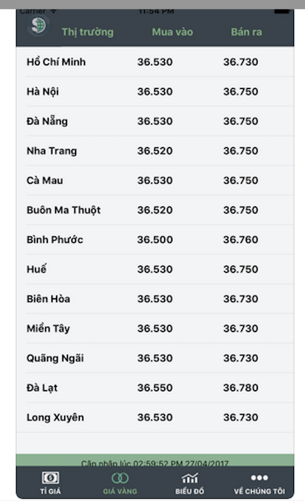

# This is X-Academy_Training IOS_CanNC1_2023 project #

## Day 1 ##

#### Objective: The trainees know how to create an iOS applicate from scratch. ####

Create a simple Rate Exchange Application which includes:

- List screen: Display a list of all rate exchanges using UITableView and Custom UITableViewCell

Rate Exchange Data is retrieved from [Tỷ giá VCB](https://portal.vietcombank.com.vn/Usercontrols/TVPortal.TyGia/pXML.aspx)

## Day 2 ##

#### Objective: The trainees are able to work with multiple features using MVVM design parttern ####

Create an tab bar application which contains two tabs:

- Tab 1: Display a list of rate exchanges from Day 1 project
- Tab 2: Display a list of Gold Price

Gold Price Data is retrieved from [Tỷ giá vàng SJC](https://www.sjc.com.vn/xml/tygiavang.xml)

